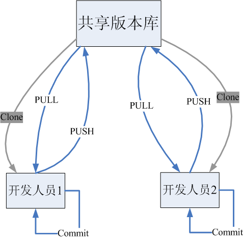
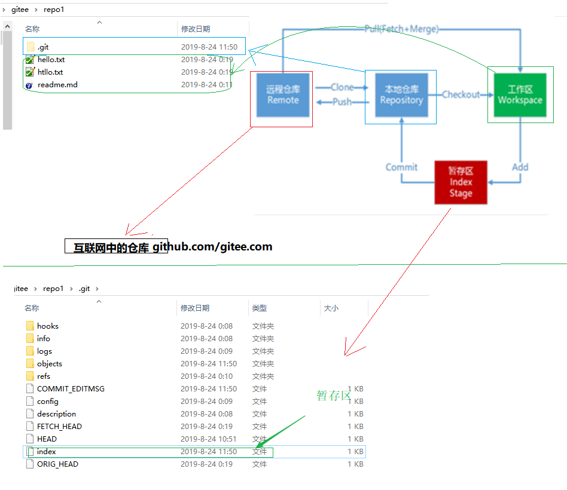
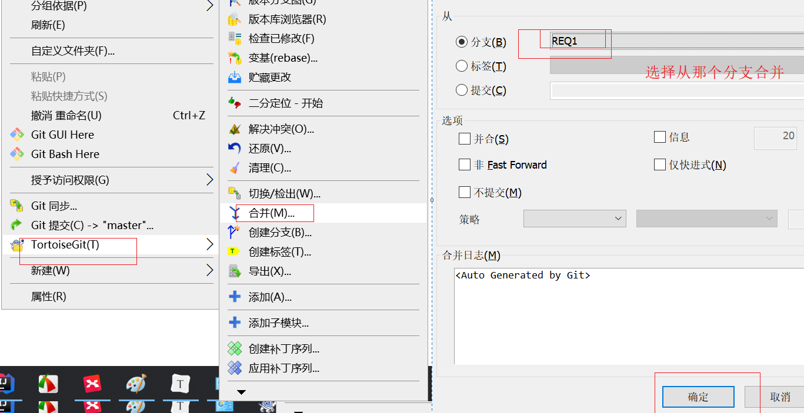

<hr/>
# git 教程

[TOC]


# 1.版本管理工具概念

我在大学毕业写论文的时候的时候碰到过如下的现象

```
<<毕业论文第一版.doc>>
<<毕业论文第二版.doc>>
<<毕业论文第三版.doc>>
<<毕业论文最终版.doc>>
<<毕业论文最终版2.doc>>
```

类似的问题我曾经也碰到过很多,例如:

```
领导让写文档,写好了,领导让修改,改好了,领导觉得第一版不错,改回来吧,此时内心一脸懵,第一版长啥样没存档啊
```

实际上,代码开发中也需要这样的软件来管理我们的代码. 例如我们经常会碰到如下的现象:

```
改之前好好的,改完就报错了,也没怎么修改啊
```

在这种情况下如果不能查看修改之前的代码,查找问题是非常困难的.

如果有一个软件能记录我们对文档的所有修改,所有版本,那么上面的问题讲迎刃而解.而这类软件我们一般叫做版本控制工具

版本管理工具一般具有如下特性:

```
1) 能够记录历史版本,回退历史版本
2) 团队开发,方便代码合并
```


# 2. 版本管理工具介绍

现在比较流行的版本管理工具是git ,但是实际上git 是近几年才发展起来的,可能有一些老的项目,还在用一些老的软件,比如svn

## 2.1版本管理发展简史(维基百科)

 

### 2.1.1 SVN(SubVersion)

工作流程

```
SVN是集中式版本控制系统，版本库是集中放在中央服务器的.
工作流程如下:
	1.从中央服务器远程仓库下载代码
	2.修改后将代码提交到中央服务器远程仓库
```

优缺点:

```
 优点: 简单,易操作
 缺点:所有代码必须放在中央服务器  
  	   1.服务器一旦宕机无法提交代码,即容错性较差
       2.离线无法提交代码,无法及时记录我们的提交行为
```

svn流程图


### 2.1.2 Git

工作流程

```
Git是分布式版本控制系统（Distributed Version Control System，简称 DVCS），分为两种类型的仓库：
本地仓库和远程仓库
工作流程如下
    1．从远程仓库中克隆或拉取代码到本地仓库(clone/pull)
    2．从本地进行代码修改
    3．在提交前先将代码提交到暂存区
    4．提交到本地仓库。本地仓库中保存修改的各个历史版本
    5．修改完成后，需要和团队成员共享代码时，将代码push到远程仓库
```



总结:git和svn的区别

```
1. svn 是集中式版本控制工具,git 是分布式版本控制工具
2. svn 不支持离线提交,git 支持离线提交代码
```

# 3. Git 发展简史

 林纳斯·本纳第克特·托瓦兹（Linus Benedict Torvalds, 1969年~ ） 


很多人都知道，Linus在1991年创建了开源的Linux，从此，Linux系统不断发展，已经成为最大的服务器系统软件了。

Linus虽然创建了Linux，但Linux的壮大是靠全世界热心的志愿者参与的，这么多人在世界各地为Linux编写代码，那Linux的代码是如何管理的呢？

事实是，在2002年以前，世界各地的志愿者把源代码文件通过diff的方式发给Linus，然后由Linus本人通过**手工方式合并代码！**

你也许会想，为什么Linus不把Linux代码放到版本控制系统里呢？那个年代不是有CVS、SVN这些免费的版本控制系统吗？因为Linus坚定地反对CVS和SVN，这些集中式的版本控制系统不但速度慢，**而且必须联网才能使用**。有一些商用的版本控制系统，虽然比CVS、SVN好用，但那是**付费**的，和Linux的开源精神不符。

不过，到了2002年，Linux系统已经发展了十年了，代码库之大让Linus很难继续通过手工方式管理了，社区的弟兄们也对这种方式表达了强烈不满，于是Linus选择了一个商业的版本控制系统BitKeeper，BitKeeper的东家BitMover公司出于人道主义精神，授权Linux社区免费使用这个版本控制系统。而授权的前提是:Linux 社区的人不能开发具有相同功能的竞争产品! 

另一方面,BitKeeper不是开源的. 显然与Linux 的开源精神不相符,所以linux 社区的很多人抱怨,不愿意使用.

典型的就是  Andrew Tridgell  (Samba 开发服务的创造者) 非常不满.偷偷违反了和 BitKeeper 的协议,反编译 BitKeeper 的源代码,开发了个爬虫,然后爬取信息被人发现了. BitKeeper 公司的领导非常不满意,然后开始发布消息说,(下个版本)不再为Linux 提供免费的服务. 

Linus  本人就出面协调(几周或者几个月),但是不管用, 没办法. 估计谈判的过程感觉到了憋屈--"吃人嘴短,拿人手软"

Linus  本人 花了10天的时间Git 出来了,一个月之内，Linux系统的源码已经由Git管理了！

 

Git 出来以后毕竟是一个人做的,开始并不好用(刚开始只能用勉强可以用来形容), 还是很多人抱怨,发展了很多年都没有干过其他软件.

直到 2008年，GitHub网站上线了，它为开源项目免费提供Git存储，无数开源项目开始迁移至GitHub,从此git 迎来了飞速发展,当下git 已经成为了最流行的版本控制工具

# 4. Git 的安装

## 4.1 git 的下载

下载地址： https://git-scm.com/download


附件


<hr/>
## 4.2 安装

1) 按照附件的 顺序直接下一步傻瓜式安装即可

2) 其中安装的过程中需要填写一个邮箱和用户名(任意即可)


3)  $\color{red}{注意: 安装完毕请重启资源管理器,或者重启电脑!!!}$ 

4) 更改语言


# 5. Git 工作流程

## 5.1 Git 初始化

我们先初始化一个本地仓

```
1) 新建测试文件夹
2) 进入文件夹,然后右键创建版本库
```


此时 我们看到 

```
1) 文件夹上多了一个绿色图标(如果没有请看本章节 5.3小节说明)
2) 文件夹内部生成了一个.git 隐藏文件夹(需要设置隐藏文件夹可见)
```

## 5.2  git 流程

### 5.2.1 流程图


### 5.2.2概念即详解

```
本地仓库：是在开发人员自己电脑上的Git仓库,存放我们的代码(.git 隐藏文件夹就是我们的本地仓库)		
远程仓库：是在远程服务器上的Git仓库,存放代码(可以是github.com或者gitee.com 上的仓库,或者自己该公司的服务器)
工作区: 我们自己写代码(文档)的地方
暂存区: 在 本地仓库中的一个特殊的文件(index) 叫做暂存区,临时存储我们即将要提交的文件
------------
Clone：克隆，就是将远程仓库复制到本地仓库
Push：推送，就是将本地仓库代码上传到远程仓库
Pull：拉取，就是将远程仓库代码下载到本地仓库,并将代码 克隆到本地工作区
```



# 6.Git 的基本使用01-TortoiseGit 操作本地仓库

## 6.1  初始化仓库

```
方法一: 
新建一个文件夹,进入文件夹内部操作
1)右键--> 在这里创建Git 版本库 
```


  注意: 不要直接在桌面上操作,否则桌面就是一个仓库

 ```
方法二:
2) 右键-->Git GUI here
 ```


```
方法三: 命令行模式
2) git init 
```


创建完毕仓库,我们发现,此时我们创建的文件夹下有一个.git 文件已经生成了

并且仓库文件夹上多了一个 绿色图标


## 6.2 添加文件

```
1)在仓库中新建一个文件
2)选中新建的文件-->右键--> TortoiseGit--> 添加
3)此时我们看到文件夹上多了一个 "加号"
```


## 6.3 提交文件至本地仓库

```
1)选中文件
2) 右键--git提交
```


## 6.4 修改文件,与再次提交文件

```
当我们修改文件以后,文件上多了一个红色感叹号,表示我们上次提交后该文件被修改过
提交后文件图标又变成绿色
```


## 6.5 文件状态讲解

```
Git工作目录下的文件存在两种状态：
1 untracked 未跟踪（未被纳入版本控制） :  比如新建的文件(此时文件夹上没有图标或者有一个"问号")
2 tracked 已跟踪（被纳入版本控制）     
    2.1 Staged 已暂存状态            : 添加 但未提交状态(此时文件夹上有一个"加号")
	2.2 Unmodified 未修改状态        : 已提交(此时文件夹上有一个"对号")
	2.3 Modified 已修改状态          : 修改了,但是还没有提交 (此时文件夹上有一个"红色感叹号")
```


这些文件的状态会随着我们执行Git的命令发生变化


## 6.6 修改文件,不提交和上一个版本比较差异(diff)

```
修改文件,此时不要提交
选中文件-->右键--> TortoiseGit--> 比较差异
```


## 6.7 查看提交历史记录

```
选中文件
右键--> TortoiseGit--> 显示日志
此时我们可以看到所有的历史提交记录
```


##6.8 回退至历史版本

```
右键--> TortoiseGit--> 显示日志
选中某个版本--> 进行如下操作
```


## 6.9 文件删除

###6.9.1本地删除与恢复

  ```
1) 直接选中文件删除的话,其实只是删除了本地工作区的文件,并没有删除 仓库中的文件
   此时时可以回退的, 比如我们进行如下操作
   1)文件删除
   2)右键--> TortoiseGit--> 还原
   此时我们发现文件又被恢复了
  ```


### 6.9.2从版本库删除

```
2) 我们如果真的想要将某个文件从服务器删除,需要进行如下操作
   1) 删除文件,和上面的操作一样
   2) 提交,此时服务文件已经删除了(历史版本还在,还是可以恢复)
```

### 6.9.3从版本库删除,但是不删除本地

```
我们可以如下操作,只删除服务器上的文件,但是本地文件并不删除
备注: 删除之后需要提交,才会真正的从服务器删除
```


## 6.10 忽略提交

````
有时候我们一些文件是不需要提交的比如说idea/eclipse 开发的代码自动生成的配置文件
如何配置不提交呢
````


此时我们的根目录下会生成一个.gitignore 文件

忽略文件如何阅读,常见格式

```yaml
# 所有以.a 结尾的文件讲被忽略(递归)
*.a
# 不管其他规则怎样,强制不忽略  lib.a
!lib.a
# 只忽略 文件 TODO (注意这里是文件)
/TODO
# 忽略 build文件夹下所有内容(递归) 这里是文件夹
build/
# 忽略 doc 目录下以 *.txt 结尾的文件 (不递归)
doc/*.txt
# 忽略 doc 目录下以 *.pdf 结尾的文件 (递归)
doc/**/*.pdf
```

当然理解了上述规则,我们也可以手动编辑该文件,而不用通过窗口化操作(如果不嫌麻烦)

# 7. Git 的基本使用02-TortoiseGit 操作本地仓库(分支)

## 7.1 分支的概念

```
几乎所有的版本控制系统都以某种形式支持分支。 使用分支意味着你可以把你的工作从开发主线上分离开来，避免影响开发主线。多线程开发,可以同时开启多个任务的开发,多个任务之间互不影响.
```

## 7.2 为何要使用分支

先看单线程开发


```
思考如下现象
    10.1 日 业务部门提出需求 : 明年 元旦3天做2个促销活动
	1) 12.31 号上线活动1, 
	2) 1.4 号上线活动2 ,同时 要求撤销 活动1
    你所在 部门领导 为了保证能顺利完成,要求 11.15 号完成 上述连个功能的开发工作
此时作为开发人员:我要面临两个文件, 活动1 的代码,即要存在(12.31 要用)又要不存在(1.4 号要求删除) ,我们怎么做?
显然比较棘手,如果使用分支(可以理解为将代码复制一份)将很好解决
```


## 7.3 创建分支

```
到现在为止,我们一直使用的时主分支(master)
在主分支上操作创建分支
```


## 7.4 分支的查看切换

### 7.4.1查看分支

```
查看版本分支图,此时我们看到有两个分支
当然,我们可以创建多个分支
可以看到多个分支的图形
```


### 7.4.2切换分支

```
右键--> 检出
```


##7.5 分支的合并与删除

### 7.5.1合并

```
我们将代码切换到分支1,然后写属于需求1 的代码并提交
当我们把需求1 开发完毕如何把需求1 的代码合并到主分支呢?
-->1 切换到 主版本
-->2 右键 合并即可将需求1 写的代码合并至主分支
-----此时我们看到代码自动合并到了master分支
```




### 7.5.2删除分支


5,冲突的处理
​	5.1)冲突的概念

````
现象演示	
	开发人员A 开发需求1,开发了一个工具类 MathUtil,里面第一行写了一个方法 add(int [] args)
 同时开发人员B 开发需求2,开发了一个工具类 MathUtil,里面第一行写了一个方法 add(int a int b)
他们在互相不知道对方需求的情况下同时提交了代码到自己的分支
   思考此时如果我们把需求1 和需求2 同时都合并到主分支上, 主分支的 工具类 MathUtil 的第一行应该使用谁的代码? 
   此时主分支是不能智能判断第一行使用谁的代码,合并时会报错,我们叫做冲突.
````


​	5.2) 如何处理冲突

```
分析一下冲突的原因:
	开发人员之间彼此没有沟通导致的同一个时间节点修改了同一个地方的代码,合并是冲突
思考:
	我们能直接把某个开发人员开发的代码删除吗?
显然不能
	所以在处理冲突时,第一步应该时找开发另一个需求的人员沟通,之后才是处理冲突
-----
--> 选中冲突的文件(带黄色感叹号的文件都是冲突的文件,如果有多个需要逐一处理)
--> 右键--> 编辑冲突,
-->处理完毕后.标记已解决
```


# 8.tag  标签 

## 8.1 标签的概念

```
如果你的项目达到一个重要的阶段，并希望永远记住那个特别的提交快照，你可以给它打上标签(tag)
比如说，我们想为我们的项目发布一个"1.0"版本。 我们给最新一次提交打上（HEAD）"v1.0"的标签。
标签可以理解为项目里程碑的一个标记,一旦打上了这个标记则,表示当前的代码将不允许提交
```

## 8.2  标签的创建(tag)

```
标签的创建和分支的创建操作几乎一样
```


## 8.3 标签的切换与删除


# 9. 远程仓库

我们的代码不能总是放在本地,因为总是放在本地,一旦电脑出现故障,数据将丢失,怎么共享呢,这里我们需要一个服务器, 我们可以把代码放到服务器上,然后让别人下载,这样我峨嵋你既可以备份代码,也可以进行团队协作开发

## 9.0 局域网仓库

```
实际上我们可以搭建一个单间的局域网服务器共享我们的代码
```

### 9.0.1本地相对路径,多个文件夹之间共享代码


### 9.0.2开启局域网共享代码


局域网这种共享是没有安全控制的,都可以访问,如果想要搭建一个可以控制权限的服务器需要借助第三方软件

gitblit,可以自行搜索搭建

## 9.1 常用远程仓库托管服务

除了自己搭建服务器,其实我们可以使用一些免费的远程仓库,远程仓库有很多,常见的免费互联网远程仓库托管服务如下:

```
www.github.com
www.gitee.com
www.gitlab.com

github  是一个基于git实现在线代码托管的仓库，向互联网开放，企业版要收钱。
gitee    即码云，是 oschina 免费给企业用的，不用自己搭建环境。
gitlab   类似 github，一般用于在企业内搭建git私服，要自己搭环境。

GitHub(gitee)、GitLab 不同点：
1、GitHub如果使用私有仓库是需要付费的，(2019年开始私有仓库也是免费的但是只能3个人协同开发,想要更多需要收费)，GitLab可以在上面搭建私人的免费仓库。
2、GitLab让开发团队对他们的代码仓库拥有更多的控制，相对于GitHub，它有不少的特色：
    (1)允许免费设置仓库权限
    (2)允许用户选择分享一个project的部分代码
    (3)允许用户设置project的获取权限，进一步提升安全性
    (4)可以设置获取到团队整体的改进进度
    (5)通过innersourcing让不在权限范围内的人访问不到该资源

```

鉴于国内用户可能网络不好,这里我们使用gitee(码云) 来讲解我们的课程,其他可自行找资料学习非常类似

## 9.2  码云账号注册


   

填写邮箱发送验证码,然后可以注册账号,主页如下


## 9.3 创建远程仓库


各个类型仓库之间的区别


## 9.4  把本地代码推送到远端


此时我们刷新仓库发现代码已经存在了

我们填写的用户信息,会被保存在本地,下次提交无需填写用户名和密码


## 9.5  从远程仓库克隆代码

我们同样可以从库下载代码,

新建一个文件夹 repo2 ,进入然后进行如下操作


此时我们发现我们的代码已经被下载下来了

## 9.6  代码的修改与提交,查看历史

```
1)此时我们修改代码就不能仅仅是提交到本地了,提交完毕应该推送到远端服务器
2)此时如果别人从远端仓库下载最新的代码其实是可以看到我们的代码修改记录的
   git -->显示日志
```


## 9.7 ssh 连接概述

```
实际上git 不仅仅支持用户名密码方式的配置,可以有另外一种相对更加安全的配置即ssh 方式配置
```

 ssh 方式的底层原理

```
ssh连接地城是RAS加密算法,又称非对称加密,是一种现在公认的最安全的加密方式
数学基础好的同学可以研究一下
https://www.cnblogs.com/cjm123/p/8243424.html

公钥私钥加密可以看作古代 的"虎符" , 我们本地电脑有一份,远程服务器有一份, 只要 "虎符" 核对通过 表示身份无误,可以执行提交等操作,无需输入用户名密码
```

## 9.8 ssh 密钥的生成

```
#生成公钥私钥
 ssh-keygen -t rsa
 一直回车即可
 会默认用户目录 .ssh 目录生成一个默认的id_rsa文件 和id_rsa.pub
```


## 9.9 ssh 密钥配置


## 9.10 ssh 方式克隆/提交代码:

  配置完成之后我们克隆我们之前的项目


修改后直接提交推送即可成功,,git 会自动去.ssh 目录找我们的私钥进行匹配

## 9.11. 远程仓库的其他操作

概念


当我们从 gitee 上查看别人的项目的时候我们可能会看到上图中的按钮

```
指数:
	是gitee 网站根据当前项目的各项指标计算出来的一个值
```


```
Star:
	点赞, 注意这里的并不像朋友圈那样容易获得点赞,圈内人还是很克制的
Watch:
   如果你watch 了某个开源项目,那么这个项目后续所有的改动你将收到通知
Fork :
	将别人的代码克隆到你自己的仓库
	作用一: 如果担心某个优秀的项目别人突然有一天不开源了,你可以fork到自己的仓库
    作用二: 修改别人的代码
	  以linux 为例,你其实不是linux 社区的开发人员,但是你 又想为linux 开发做贡献(维护代码)
	   你并没有权限,怎们办?
	   你可以先把linux 开源的代码 fork 到你自己的仓库,此时你就可以操作自己的仓库进行修改代码了
	   如何让别人合并你修改好的代码呢? 
	    我们注意项目的上方有一个 " Pull Request" 这个按钮的意思是 "请求求别人合并你修改的代码"
	    当我们发起一个 Pull Request 时 , 项目的拥有者将收到 Pull Request请求,然后将根据你提交代码的质量决定是否合并
```

项目操作

1)我们可以删除修改我们自己仓库的基本信息

2) 我们可以邀请其他人成为项目的开发人员或者管理人员


我们可以删除修改我们自己仓库的基本信息


## 9.12 利用 gitee 搭建个人主页

```
1)将静态资源上传至仓库
2) 选择服务 pages 即可部署
注意 1)必须有个index.html 文件
注意 2) 只能搭建静态网站,动态网站请租赁服务器搭建提供服务
注意 3) gitee 要求必须绑定手机号

```


点击开启后gitee 会自动生成一个域名


直接访问即可

此时我们已经在git 上部署了一个静态的网站


# 10.命令行-- git基本操作

## 10.1  介绍

​	上述我们的操作 使用的 是客户端TortoiseGit 操作的git ,实际上底层依旧是使用的命令行帮我们执行, 在早期 git 并没有窗口化工具,开发人员只能使用命令行模式

  实际上,如果你掌握并熟练使用了命令行模式操作git 的话,你会发现某些操作命令行比窗口化操作要简单

所有你在工作中会发现高深的技术人员可能会喜欢命令行模式提交git

##10.2 环境配置

当安装Git后首先要做的事情是设置用户名称和email地址。这是非常重要的，因为每次Git提交都会使用该用户信息

```shell
#设置用户信息 
   git config --global user.name “itcast”
   git config --global user.email “itcast@itcast.cn”
#查看配置信息
   git config --list
   git config user.name
#通过上面的命令设置的信息会保存在~/.gitconfig文件中

```

##10.3  初始化本地仓库 init

```shell
# 初始化仓库带工作区
git init
# 初始化仓库不带工作区
git init --bare  
```

##10.4 克隆 clone

```shell
# 从远程仓库克隆
git clone 远程Git仓库地址 
例如: git clone https://gitee.com/itcast/gittest.git
```

##10.5  查看状态 status

```shell
# 查看状态
git status 
#查看状态 使输出信息更加简洁
git status –s 
```

##10.6 add 

```shell
# 将未跟踪的文件加入暂存区
git add  <文件名>  
# 将暂存区的文件取消暂存 (取消 add )
git reset  <文件名>  

```

##10.7 commit

```shell
# git commit 将暂存区的文件修改提交到本地仓库
git commit -m "日志信息"  <文件名>  

```

##10.8 删除 rm

```shell
# 从本地工作区 删除文件
git rm <文件名>  
# 如果本工作区库误删, 想要回退
git checkout head <文件名>  
```

# 11. 命令行--git 远程仓库操作

## 11.1    查看远程 

```shell
# 查看远程  列出指定的每一个远程服务器的简写
git remote 
# 查看远程 , 列出 简称和地址
git remote  -v  
# 查看远程仓库详细地址
git remote show  <仓库简称>

```

## 11.2 添加/移除远测仓库

```shell
# 添加远程仓库
git remote add <shortname> <url>
# 移除远程仓库和本地仓库的关系(只是从本地移除远程仓库的关联关系，并不会真正影响到远程仓库)
git remote rm <shortname> 
```

## 11.3 从远程仓库获取代码

```shell
# 从远程仓库克隆
git clone <url> 
# 从远程仓库拉取 (拉取到.git 目录,不会合并到工作区,工作区发生变化)
git fetch  <shortname>  <分支名称>
# 手动合并  把某个版本的某个分支合并到当前工作区
git merge <shortname>/<分支名称>
# 从远程仓库拉取 (拉取到.git 目录,合并到工作区,工作区不发生变化) = fetch+merge
git pull  <shortname>  <分支名称>
git pull  <shortname>  <分支名称>  --allow-unrelated-histories  #  强制拉取合并
```

注意：如果当前本地仓库不是从远程仓库克隆，而是本地创建的仓库，并且仓库中存在文件，此时再从远程仓库拉取文件的时候会报错（fatal: refusing to merge unrelated histories ），解决此问题可以在git pull命令后加入参数--allow-unrelated-histories (如上 命令)

```shell
# 将本地仓库推送至远程仓库的某个分支
git push [remote-name] [branch-name]
```

# 12.  命令行-- 分支

```shell
# 默认 分支名称为 master
# 列出所有本地分支
git branch
# 列出所有远程分支
git branch -r
# 列出所有本地分支和远程分支
git branch -a
# 创建分支
git branch <分支名>
# 切换分支 
git checkout <分支名>
# 删除分支(如果分支已经修改过,则不允许删除)
git branch -d  <分支名>
# 强制删除分支
git branch -D  <分支名>
```

```shell
# 提交分支至远程仓库
git push <仓库简称> <分支名称>	
# 合并分支 将其他分支合并至当前工作区
git merge <分支名称>
# 删除远程仓库分支
git push origin –d branchName
```

# 13 . 命令行 --tag

```shell
# 列出所有tag
git tag
# 查看tag详细信息 
git show [tagName]
# 新建一个tag
git tag [tagName]
# 提交指定tag
$ git push [仓库简称] [tagName]
# 新建一个分支，指向某个tag
$ git checkout -b [branch] [tag]
# 删除本地tag
$ git tag -d [tag]
# 删除远程tag (注意 空格)
$ git push origin :refs/tags/[tag]
```

# 14. 案例

```
企业中我们是如何开发的
1) 入职第一天,管理人员分配/git账号密码 
2) 开发人员下载代码即文档/ 根据文档将环境搭建成功
3) 团队一般会给你讲讲项目相关的支持
----
4) 你接到第一个需求(或者某个功能,一般要经过沟通,分析,设计...等过程)
5) 创建feature分支(一般一个需求对应一个feature,命名格式上标注该需求的id)
6) 开发需求,本地测试,提交代码到当前需求对应的feature分支,
	一般来讲为了避免将测试代码提交,需要提交前,检查如下步骤
	6.1) 是否多提交了某个文件,比如测试文件
	6.2) 是否漏提交文件
	6.3) 打开每一个应该提交的文件,判断是否多提交了一行代码,是否少提交了一行代码,是否删除了本应该存在的代码 
	检查完毕提交代码
7) 合并分支至test分支-- 测试人员会在test分支中测试
8) 测试人员测试bug ,开发者在feature分支上继续修改,提交
9) 测试人员测试通过 ,test分支会被测试人员合并到develop开发分支,再次测试
10)develop分支最终会被合并到master主分支

```


   


`